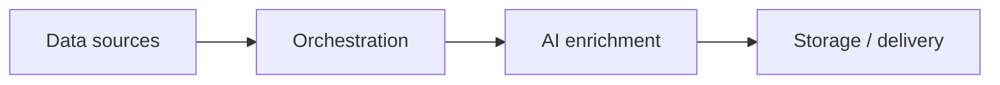

<!-- markdownlint-disable MD033 -->
<div align="center">
  
  
  <br /><br />
  
  
  
  
  
</div>
<!-- markdownlint-enable MD033 -->

---

Ce dépôt rassemble **trois flux de travail automatisés** (n8n, Make) avec intégration de l'intelligence artificielle (OpenAI, Gemini), déployables de manière autonome ou via Docker. Chaque sous-dossier contient le flux de travail exporté, les ressources associées et, le cas échéant, un frontend ou une démonstration.

### Structure du dépôt

```
no-low-code/
├── gmail/                  # Gmail AI Dashboard (n8n + Docker + frontend)
│   ├── docker-compose.yml
│   ├── json/workflow.json
│   ├── assets/
│   └── frontend/
├── multi-scraper/          # Multi-Scraper (Make → Google Sheets)
│   ├── json/workflow.json
│   └── assets/
└── tiktok/                 # TikTok Intelligence (n8n → Airtable)
    ├── json/workflow.json
    └── assets/
```

### Cœur technique

| Couche | Technologies |
|-------|--------|
| **Orchestration** | n8n, Make |
| **IA** | OpenAI GPT-3.5, Google Gemini |
| **Scraping** | Apify (TikTok, Instagram) |
| **Stockage** | Airtable, Google Sheets, JSON (fichier) |
| **APIs** | Gmail API, TikTok (via Apify) |
| **Exécution** | Docker (Gmail), Make/n8n cloud (autres) |

### Architecture globale

**Contexte de recherche** : Ce dépôt est utilisé dans le cadre de recherches sur **les méthodes de collecte et d'exploitation de données issues des réseaux sociaux et canaux de communication** (e-mails, TikTok, Instagram, flux RSS) **à l'aide d'outils d'automatisation no-code / low-code**. L'objectif est d'évaluer l'orchestration (n8n, Make), le scraping (Apify), l'enrichissement par l'IA (LLM, vision) et le stockage (Airtable, Google Sheets) afin de construire des pipelines reproductibles sans développement lourd sur mesure.

Les trois flux de travail partagent le même modèle de haut niveau : **sources de données → orchestration → enrichissement IA → stockage ou livraison**.



---

## Flux de travail (Workflows)

### [Gmail AI Dashboard](gmail/)

Pipeline de bout en bout : récupération des e-mails Gmail via l'API officielle, analyse avec OpenAI (résumés, détection d'urgence), puis affichage des résultats dans une **interface web** (tri, épinglage, archivage, filtres). Déploiement en une seule commande avec **Docker**. Idéal pour centraliser le suivi des e-mails et prioriser les messages sans ouvrir Gmail.

**Installation (ce flux uniquement)**

```bash
git clone --filter=blob:none --sparse https://github.com/RomeoCavazza/no-low-code.git
cd no-low-code && git sparse-checkout set gmail && cd gmail
```

| Rôle | Détails |
|------|--------|
| Extraction | Récupération automatique des derniers e-mails (API Gmail, fenêtre de 24h) |
| Analyse | Résumés + détection d'urgence (OpenAI GPT-3.5) |
| Interface | Tableau de bord en JS natif (HTML5, CSS3, localStorage, Lucide) |
| Déploiement | `docker-compose` (n8n + serveur statique) |


*Flux n8n : déclencheur, récupération Gmail, analyse OpenAI, écriture du JSON.*


*Tableau de bord web : résumé de l'IA, indicateur d'urgence, filtres et actions sur les e-mails.*

---

### [Multi-Scraper IA](multi-scraper/)

Veille automatisée multi-source : agrégation de **flux RSS** (NVIDIA, OpenAI, Google, Microsoft…) et de comptes tech **Instagram** via Apify, enrichissement par résumés GPT et analyse d'images par Gemini, **déduplication**, puis export vers **Google Sheets**. Faites tourner un tableau de bord de veille IA sans code. **Démo** : [Google Sheet](https://docs.google.com/spreadsheets/d/17JXOTxNk7-EDYpSQIKgBH-hyClpwn7jkmSknl3Azs1A/edit).

**Installation (ce flux uniquement)**

```bash
git clone --filter=blob:none --sparse https://github.com/RomeoCavazza/no-low-code.git
cd no-low-code && git sparse-checkout set multi-scraper && cd multi-scraper
```

| Rôle | Détails |
|------|--------|
| Agrégation | RSS + Instagram (Apify) |
| Enrichissement | Résumés GPT-3.5 + analyse d'images par Gemini Pro |
| Déduplication | Traitement pré-export pour éviter les doublons |
| Export | Google Sheets (Titre, URL, date, source, résumé de l'IA) |


*Scénario Make : agrégation RSS + Instagram, enrichissement OpenAI + Gemini, déduplication, export Google Sheets.*


*Rendu Google Sheets : titre, URL, date, source, résumé de l'IA.*

---

### [TikTok Intelligence](tiktok/)

Extraction TikTok par **mots-clés** ou **comptes** : statistiques (vues, likes, commentaires, partages), extraction de **sous-titres VTT**, résumés et analyses stratégiques via OpenAI, puis sauvegarde sur **Airtable**. Utile pour le suivi des créateurs, la veille de tendances ou l'analyse de contenu vidéo.

**Installation (ce flux uniquement)**

```bash
git clone --filter=blob:none --sparse https://github.com/RomeoCavazza/no-low-code.git
cd no-low-code && git sparse-checkout set tiktok && cd tiktok
```

| Rôle | Détails |
|------|--------|
| Source | TikTok via Apify (mots-clés ou identifiants de compte) |
| Statistiques | Vues, likes, commentaires, partages |
| Transcriptions | Extraction automatique des sous-titres VTT |
| Analyse | Résumés et analyses OpenAI → Airtable |


*Flux n8n : formulaire web, Apify TikTok, sous-titres VTT + OpenAI, Airtable.*


*Formulaire web : mots-clés, comptes, période, résultats.*


*Table Airtable : URL de la vidéo, auteur, statistiques, transcription, résumé de l'IA.*

---

Chaque flux de travail est **autonome** : clonez le sous-dossier, importez le fichier JSON dans n8n ou Make, configurez vos identifiants (clés d'API, OAuth, jetons Apify) et lancez l'exécution. Aucun backend sur mesure n'est requis en dehors de l'orchestrateur et des services cloud connectés (Airtable, Google Sheets, Gmail).
